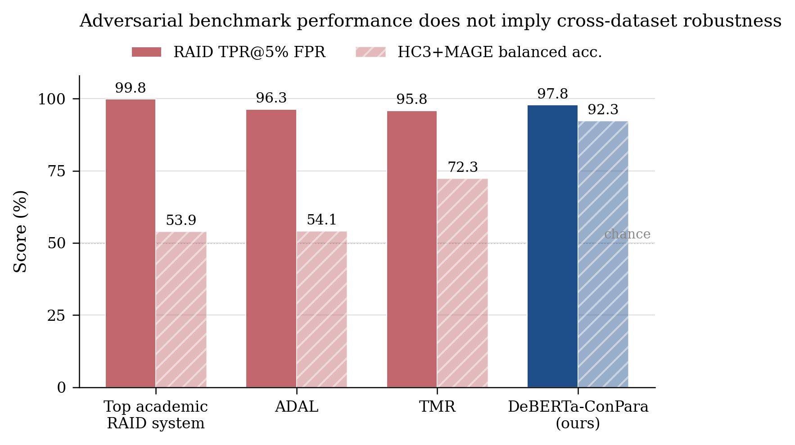
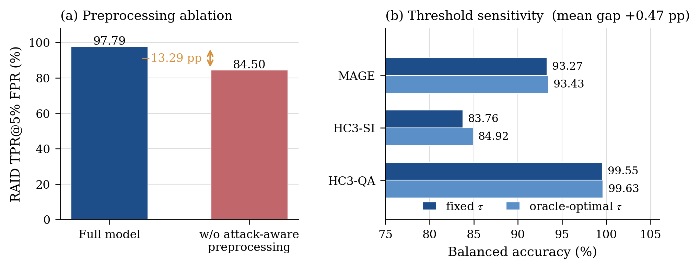
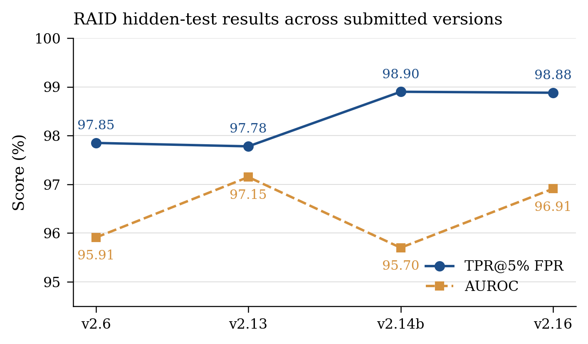
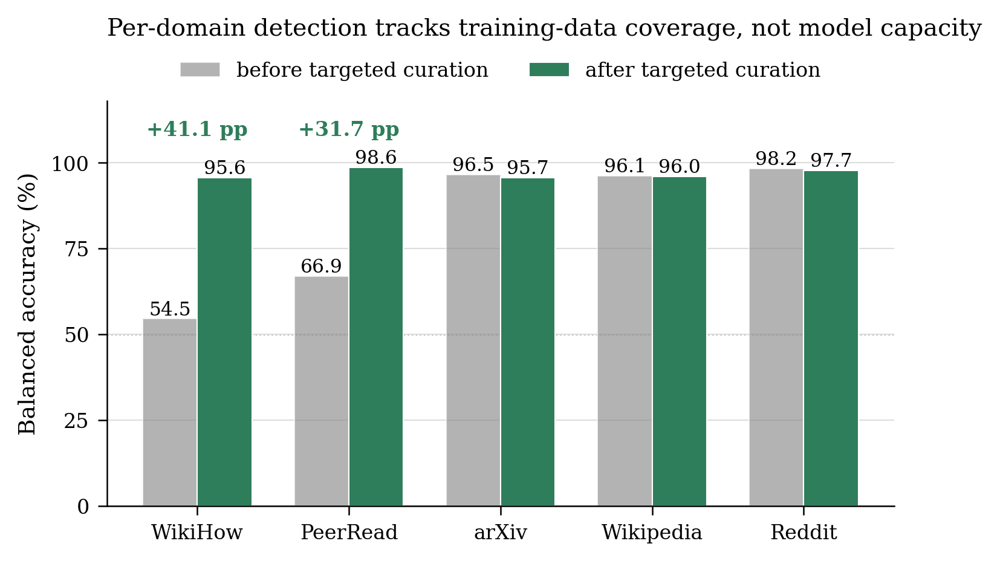
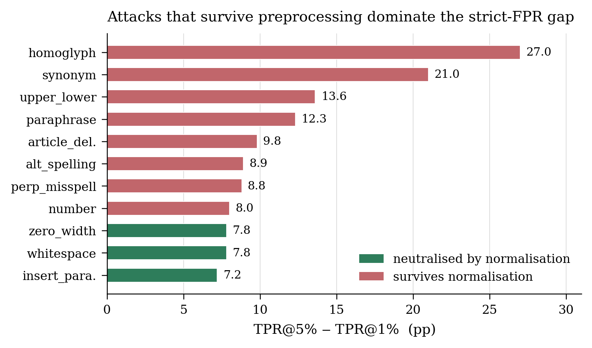

# DeBERTa-ConPara

**Attack-Aware and Deployment-Realistic Detection of AI-Generated Text**

Mohamed Mady · Yupei Li · Johannes Reschke · Björn W. Schuller

<!-- badges: uncomment on public release
[](.)
[](.)
[](https://raid-bench.xyz)
-->

A deployment-oriented detector for AI-generated text that is robust to
adversarial perturbation **and** to distribution shift across corpora — a
combination that, to our knowledge, no prior open academic system achieves.

---

## The problem this addresses

Detectors that top adversarial benchmarks routinely collapse when evaluated on
data from a different corpus. This is not a marginal effect: systems scoring
near-ceiling on RAID fall to roughly chance on HC3 Plus and MAGE under an
identical fixed-threshold protocol.



| System | RAID TPR@5% FPR | HC3+MAGE balanced acc. |
|---|---|---|
| Top academic RAID system | 99.8% | 53.9% |
| ADAL (RoBERTa-large + adversarial T5) | 96.3% | 54.1% |
| TMR (RoBERTa-base + hard-negative mining) | 95.8% | 72.3% |
| Desklib v1.01 (DeBERTa-v3-large, no features/preprocessing) | 91.2% | — |
| **DeBERTa-ConPara (ours)** | **97.79%** | **92.31%** |

Cross-dataset figures were measured by us on our HC3 Plus and MAGE test sets at
a fixed threshold (τ = 0.5). RAID figures are from the public leaderboard.

---

## Method

Four components, evaluated independently:

**1 · Attack-aware preprocessing.** Deterministic four-layer Unicode
normalisation applied before tokenisation: explicit homoglyph substitution
(Cyrillic / Greek / fullwidth → Latin), NFKD decomposition with combining-mark
stripping, typographic normalisation, and removal of invisible format
characters. Idempotent, ~0 ms overhead, no learned parameters.

**2 · Feature fusion.** 62 linguistic and statistical features (perplexity,
burstiness, readability, syntactic and lexical statistics) reduced to 30 by
mutual information, projected and fused with the DeBERTa `[CLS]` representation
through a learned gate.

**3 · Multi-corpus curation.** Training draws on HC3 Plus, M4, MAGE and RAID —
35+ generators, 13+ domains, 11 adversarial attack categories — balanced so
that no single corpus dominates either class.

**4 · Fixed-threshold evaluation.** All reported numbers use a single threshold
calibrated once on a held-out validation split, never tuned per test set.



Removing preprocessing costs **−13.29 pp** RAID TPR@5% while leaving clean-text
performance essentially unchanged (< 0.5 pp) — it is a defence against
surface-form attack, not a general accuracy gain. Oracle access to a per-dataset
optimal threshold would improve balanced accuracy by only **+0.47 pp** on
average, which is what makes the fixed-threshold protocol defensible.

---

## Results

### RAID hidden test

| Version | TPR@5% FPR | TPR@1% FPR | AUROC |
|---|---|---|---|
| v2.6 | 97.85% | 93.39% | 95.91% |
| v2.13 | 97.78% | 93.86% | **97.15%** |
| v2.14b | **98.90%** | — ¹ | 95.70% |
| v2.16 | 98.88% | 87.20% | 96.91% |

¹ No threshold achieving 1% FPR existed on every domain, so the entry is
excluded from the main leaderboard at that operating point.



### Cross-dataset (fixed threshold)

| Benchmark | Balanced acc. | AUROC | n |
|---|---|---|---|
| HC3-QA | 99.62% | 0.9999 | 24,969 |
| HC3-SI | 86.35% | 0.9471 | 38,110 |
| MAGE | 94.62% | 0.9867 | 60,743 |
| SemEval-2024 Task 8A (mono) | 84.37% | 0.9821 | 34,272 |
| M4GT-Bench Subtask A (en) | **96.40%** | 0.9964 | 152,809 |

---

## What actually drives per-domain performance

The strongest empirical finding here is negative in flavour and, we think, the
most useful thing in the paper: **per-domain detection quality tracks training
data coverage, not model capacity.**



Two controlled single-factor experiments on M4GT-Bench, changing nothing but
the training data:

| Domain | Before | After | Δ | Intervention |
|---|---|---|---|---|
| PeerRead | 66.9% | 98.6% | **+31.7 pp** | +33 K PeerRead samples, 5 generators |
| WikiHow | 54.5% | 95.6% | **+41.1 pp** | +13,958 samples, 7 modern generators |

Domains already covered moved by ≤ 0.8 pp. A domain sitting near chance is
therefore not evidence of an intrinsic detection limit — it is evidence of a
gap in generator coverage. WikiHow in M4 is generated exclusively by 2022-era
models; adding contemporary generators resolves it entirely.

---

## Where it still fails



At 1% FPR the picture is materially worse than at 5%, and the gap is
concentrated in attacks that survive deterministic normalisation. Attacks that
normalisation fully neutralises (whitespace, zero-width, paragraph insertion)
show ~7–8 pp gaps; those that survive — homoglyph, synonym substitution,
case perturbation, paraphrase — show 12–27 pp.

The mechanism is a false-positive tail rather than a detection failure: at a
strict FPR the threshold is set by the most AI-like *human* texts, and attacked
human text scores anomalously. Per-domain, `reviews` is worst (55.6% TPR@1%),
followed by `poetry` (80.2%) and `reddit` (82.4%).

Other honest limitations: English only; Cohere remains the weakest generator
family across every version (96.2% TPR@5%, 73.1% TPR@1%); and short texts
(< 75 words) account for the large majority of HC3-SI errors.

---

## Repository layout

```
.
├── src/
│   ├── unicode_preprocessing_v2.py   # attack-aware normalisation
│   └── features.py                   # 62-feature extractor
├── training/
│   ├── train_conpara.py              # main training script
│   └── build_dataset.py              # corpus assembly + stratified splits
├── evaluation/
│   ├── eval_cross_dataset.py         # HC3 / MAGE / SemEval / M4GT-Bench
│   ├── eval_threshold_sweep.py       # fixed vs oracle threshold
│   └── raid_submission.py            # leaderboard prediction generation
├── scripts/
│   └── make_figures.py               # regenerates every figure below
├── figures/                          # PDF (vector) + SVG (editable) + PNG
├── results/                          # per-attack / domain / generator tables
└── docs/
    ├── REPRODUCTION.md
    ├── DATA.md                       # licences and acquisition
    └── LIMITATIONS.md
```

## Quick start

```bash
git clone https://github.com/<user>/deberta-conpara
cd deberta-conpara
pip install -r requirements.txt

# reproduce every figure in this README
python3 scripts/make_figures.py
```

Full data acquisition, training and evaluation instructions are in
[`docs/REPRODUCTION.md`](docs/REPRODUCTION.md).

---

## Data

We do not redistribute the training corpora. Each is obtained from its original
source under its own licence, and `training/build_dataset.py` reconstructs the
exact splits deterministically (seed 42). See [`docs/DATA.md`](docs/DATA.md).

| Corpus | Source | Redistributed here |
|---|---|---|
| HC3 Plus | HuggingFace | no |
| M4 | GitHub (M4 authors) | no |
| MAGE | HuggingFace | no |
| RAID | `raid-bench` package | no |
| M4GT-Bench | GitHub | no |
| WikiHow generations (ours) | this work | see `docs/DATA.md` |

---

## Intended use and misuse

This is a research artifact. Detector output is **not** evidence of academic
misconduct and must not be used as such. Our own measurements record false
positive rates of 13–67% on formal academic prose depending on domain, and
error rates rise sharply on texts under 75 words. Any deployment affecting
individuals should treat a positive score as, at most, weak circumstantial
signal warranting human review.

## Citation

```bibtex
@inproceedings{mady2026conpara,
  title     = {DeBERTa-ConPara: Attack-Aware and Deployment-Realistic
               Detection of AI-Generated Text},
  author    = {Mady, Mohamed and Li, Yupei and Reschke, Johannes
               and Schuller, Bj{\"o}rn W.},
  booktitle = {Findings of EMNLP},
  year      = {2026}
}
```

## Licence

Code released under MIT. Model weights and any released generations carry their
own terms — see `docs/DATA.md`.
